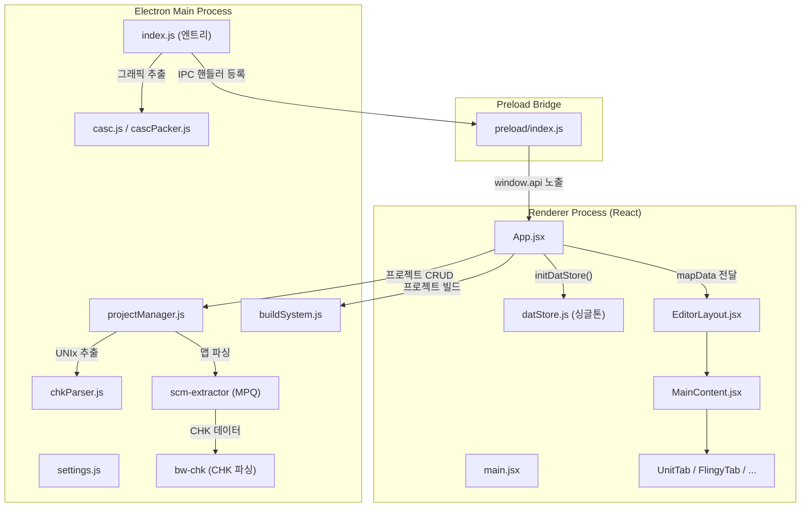
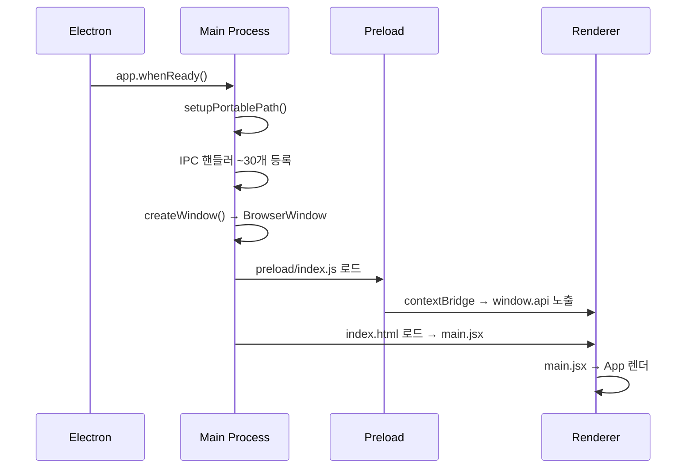
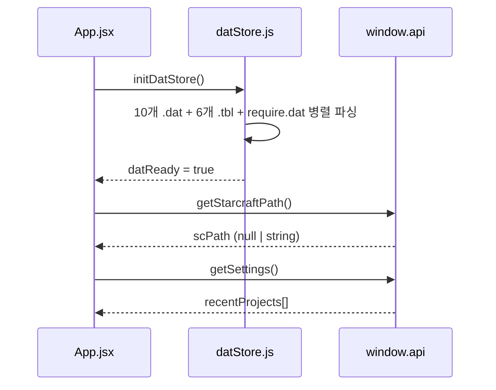
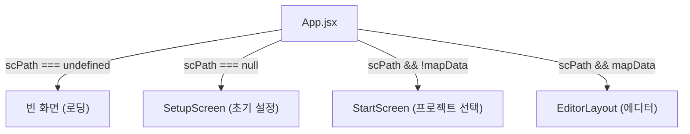
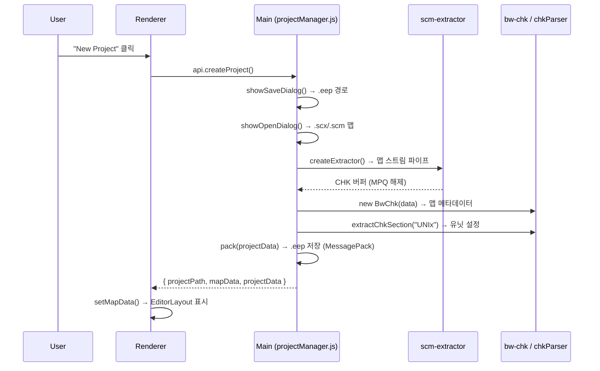
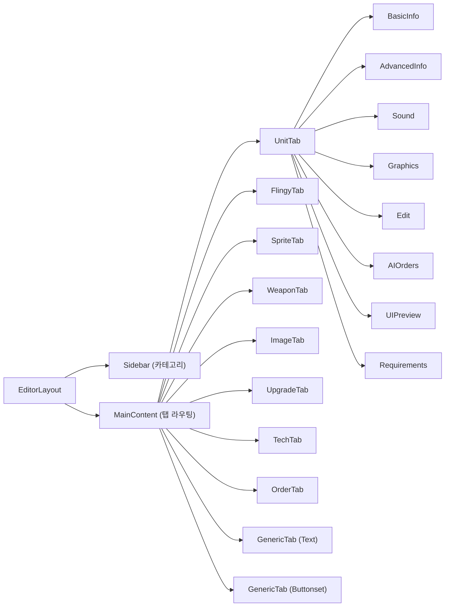
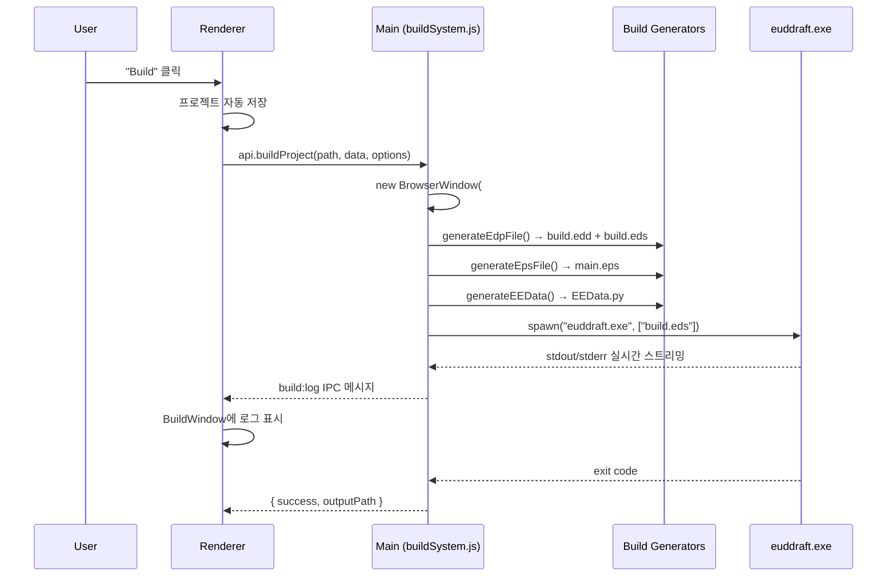

# EUD Editor — 실행 흐름도 (Execution Flow)

## 전체 아키텍처



---

## Phase 1: 앱 시작 (Application Boot)



### 상세 흐름

| 순서 | 위치 | 동작 |
|------|------|------|
| 1 | `src/main/index.js:19` | `setupPortablePath()` — 포터블 데이터 경로 설정 |
| 2 | `src/main/index.js:65` | `app.whenReady()` — Electron 초기화 완료 대기 |
| 3 | `src/main/index.js:78~439` | IPC 핸들러 등록 (프로젝트, CASC, 설정, 다이얼로그 등) |
| 4 | `src/main/index.js:22~59` | `createWindow()` — 1440×810 프레임리스 윈도우 생성 |
| 5 | `src/preload/index.js:58~61` | `contextBridge`로 `window.api` 객체 렌더러에 노출 |
| 6 | `src/renderer/src/main.jsx:8~13` | URL 해시로 `#/build`이면 `BuildWindow`, 아니면 `App` |

---

## Phase 2: 초기 데이터 로드 (Data Initialization)



### DAT Store 로드 목록

`initDatStore()`에서 **한 번에 병렬 로드**하는 파일들:

| 카테고리 | 파일 | 용도 |
|---------|------|------|
| DAT | units.dat, flingy.dat, images.dat, weapons.dat 외 6개 | 유닛/무기/업그레이드 등 게임 속성 |
| TBL | stat_txt.tbl (EN/KR 3종), portdata.tbl, sfxdata.tbl, images.tbl | 이름/경로 문자열 테이블 |
| REQ | require.dat | 유닛 생산 조건 데이터 |

> **참고**: `datStore.js`는 모듈 레벨 싱글톤으로, 최초 한 번만 로드 후 메모리에 캐싱됩니다. 이후 `getUnitsData()`, `getFlingyData()` 등의 getter로 접근합니다.

---

## Phase 3: 화면 분기 (Screen Routing)



### 3가지 진입 경로

1. **SetupScreen** — 스타크래프트 경로 미설정 시 → `.exe` 선택 → CASC 그래픽 추출
2. **StartScreen** — 경로 설정 완료 후 → New Project / Open Project / Recent Projects
3. **EditorLayout** — 프로젝트가 열린 상태 → 편집기

---

## Phase 4: 프로젝트 열기/생성 (Project Flow)



### 프로젝트 파일 (.eep) 구조

```
{
  version: "1.0",
  mapPath: "C:/.../map.scx",      // 원본 맵 절대경로
  projectData: {
    units: { [unitId]: { field: value, ... } },
    weapons: { ... },
    upgrades: { ... },
    images: { ... }
  }
}
```

> **포맷**: MessagePack 바이너리. 기존 JSON 형식도 자동 감지하여 호환 로드합니다.

---

## Phase 5: 에디터 화면 (Editor UI Structure)



### 데이터 흐름

```
App.projectData (state)
  ↓ props 전달
EditorLayout → MainContent → UnitTab (각 서브탭)
  ↓ 사용자가 값 편집
onUpdateProjectUnit(unitId, field, value)
  ↓ setState (불변 업데이트)
App.projectData 업데이트
```

- `projectData`는 `{ units: {}, weapons: {}, upgrades: {}, images: {} }` 구조
- 각 ID별로 **변경된 필드만** 저장 (delta 방식)
- 전체 DAT 기본값은 `datStore.js`에서 읽고, 사용자 수정분만 `projectData`에 오버레이

---

## Phase 6: 빌드 시스템 (Build Flow)



### 빌드 생성 파일

| 파일 | 생성 모듈 | 역할 |
|------|-----------|------|
| `.eudeditor/build.edd` | `generateEdpFile.js` | euddraft 입출력 맵 경로 설정 |
| `.eudeditor/build.eds` | `generateEdpFile.js` | euddraft 플러그인 설정 |
| `main.eps` | `generateEpsFile.js` | EPS(EUD Plugin Script) 메인 스크립트 |
| `EEData.py` | `generateEEData.js` | 유닛 데이터 패치 Python 코드 (delta 기반) |

### 빌드 디렉토리 구조

```
{프로젝트 폴더}/
  build/
    .eudeditor/
      build.edd        ← 입출력 맵 설정
      build.eds        ← 플러그인 설정
    main.eps           ← EPS 메인 스크립트
    EEData.py          ← 데이터 패치 코드
```

---

## Context Provider 계층

```
<I18nProvider>           ← 다국어 (en/ko)
  <SettingsProvider>     ← 전역 설정 (playerColor 등)
    <ThemeProvider>       ← 테마 (dark/light/custom)
      <NavigationProvider> ← 크로스탭 네비게이션
        <App/>
      </NavigationProvider>
    </ThemeProvider>
  </SettingsProvider>
</I18nProvider>
```

---

## 핵심 IPC 채널 요약

| 채널 | 방향 | 용도 |
|------|------|------|
| `project:create` | R→M | 프로젝트 생성 (.eep) |
| `project:open` | R→M | 프로젝트 열기 |
| `project:openByPath` | R→M | 최근 프로젝트 빠르게 열기 |
| `project:save` | R→M | 프로젝트 저장 |
| `project:build` | R→M | 빌드 실행 |
| `build:log` | M→R | 빌드 로그 스트리밍 |
| `starcraft:extract` | R→M | CASC 그래픽 추출 |
| `starcraft:extract-progress` | M→R | 추출 진행률 |
| `starcraft:getFile` | R→M | CASC 파일 읽기 |
| `starcraft:listFiles` | R→M | CASC 파일 목록 |
| `app:getDatapackFile` | R→M | 캐시된 데이터팩 읽기 |
| `app:getSettings` | R→M | 설정 읽기 |
| `app:saveSettings` | R→M | 설정 저장 |
| `app:saveUnitPreview` | R→M | 유닛 프리뷰 이미지 저장 |
| `app:getUnitPreviewUrl` | R→M | 유닛 프리뷰 URL 조회 |
| `app:saveImagePreview` | R→M | 이미지 프리뷰 저장 |
| `app:deleteSettings` | R→M | 설정 초기화 |
| `app:deleteDatapack` | R→M | 데이터팩 삭제 |
| `window:minimize` | R→M | 창 최소화 |
| `window:maximize` | R→M | 창 최대화/복원 |
| `window:close` | R→M | 창 닫기 |
| `window:resetSize` | R→M | 창 크기 초기화 |
| `window:saveEditorBounds` | R→M | 에디터 창 크기 기억 |
